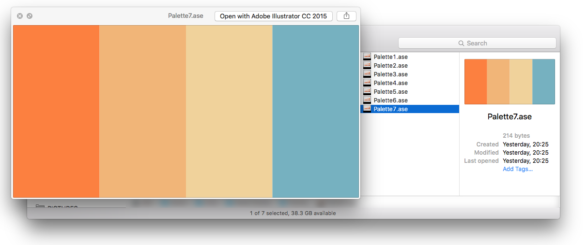

# AdobeXD MacOS Quick Look Plugin

[](https://github.com/iamogbz/macos-quick-look-plugin-adobe-xd/actions/workflows/xcode.yml)

Enables previews of XD files [(Adobe Experience Designer)][adobe-xd].

## Install

If you want to skip compilation and just install it, [download release][ql-xd-releases], unzip and copy `QuickLookXD.qlgenerator` to `~/Library/QuickLook/`. To reach that folder in Finder, go to your Home, click on the Go menu on the top bar, hold the Option key and `Library` will magically appear.

Or copy it from a terminal:

```sh
cp -R QuickLookXD.qlgenerator ~/Library/QuickLook/
```

<!--
Alternatively, if you use [Homebrew-Cask](https://github.com/caskroom/homebrew-cask), install with:

```sh
brew cask install quicklookxd
```
-->

## Demo



## Notes

How to find the UTI of a file:

```sh
$ mdls -name kMDItemContentType ./docs/example/file01.xd
kMDItemContentType = "com.adobe.xd.project"
```

Testing the generated quick look bundle:

```sh
$ qlmanage -g QuickLookXD.qlgenerator -c com.adobe.xd.project -p document.xd
Testing Quick Look preview with files:
    /tmp/quicklookxd/document.xd
    - force using content type UTI: com.adobe.xd.project
    - force using generator at path: /tmp/quicklookxd/QuickLookXD.qlgenerator
```

### References

* [QuickLookASE][ql-ase]
* [QL plugin discussion][ql-win-issue]
* [XD format reference][xd-format-reference]

<!-- Links -->

[adobe-xd]: https://www.adobe.com/ca/products/xd.html
[ql-ase]: https://github.com/rsodre/QuickLookASE
[ql-win-issue]: https://github.com/QL-Win/QuickLook/issues/307#issuecomment-1473989813
[ql-xd-releases]: https://github.com/iamogbz/macos-quick-look-plugin-adobe-xd/releases
[xd-format-reference]: https://docs.fileformat.com/web/xd
